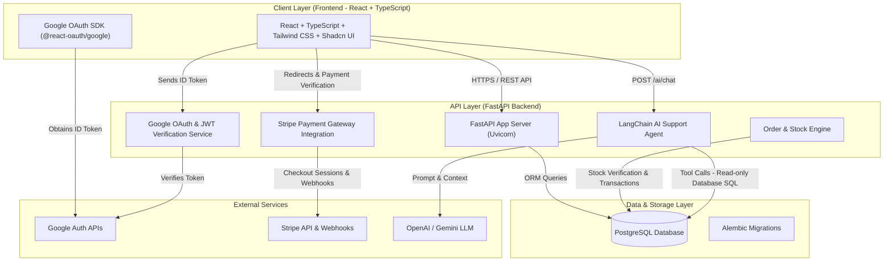
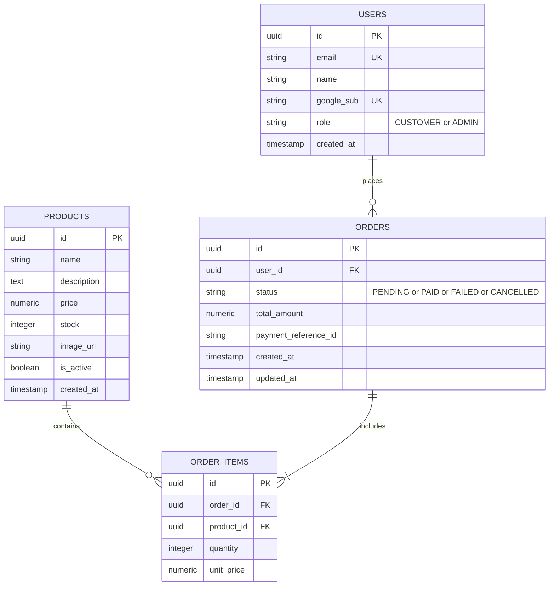

# 💻 Mini AI E-Commerce Frontend (Assignment 2)

React + TypeScript frontend application for the Mini AI E-Commerce Application. Built with **React 18**, **TypeScript**, **Vite**, **Tailwind CSS**, and styled following the **Shadcn UI** modern SaaS dashboard aesthetic. Features **Google OAuth Sign-In**, **Product Catalog**, **Shopping Cart**, **Stripe Checkout**, **Customer Order History**, **Admin Dashboard**, and an **AI Customer Support Chat Widget**.

---

## 📋 Required Deliverables Summary

| Deliverable | Details |
| :--- | :--- |
| **Total Time Taken** | **24 Hours** |
| **AI Tools Used** | **OpenAI Codex** |
| **One-Page System Design** | Full Architectural Diagram included below |
| **Database Schema** | Relational PostgreSQL ER Diagram included below |
| **Basic API Documentation** | REST API Endpoints Specification included below |

---

## ⏱️ Total Time Taken
* **24 Hours** total development time.

## 🤖 AI Tools Used
* **OpenAI Codex**: Primary AI assistant used for Shadcn UI component architecture, responsive layout design, Google OAuth integration, Cart state management, and API client integration with FastAPI.

---

## 📐 One-Page System Design



---

## 🗄️ Database Schema



---

## 🔌 Basic API Documentation

| Endpoint | Method | Access | Description |
| :--- | :--- | :--- | :--- |
| `/auth/google` | `POST` | Public | Authenticates via Google ID Token, registers user, issues JWT. |
| `/products` | `GET` | Public | Lists available products. |
| `/products/{id}` | `GET` | Public | Retrieves specific product details. |
| `/orders` | `POST` | Authenticated | Creates a new order. |
| `/orders/me` | `GET` | Customer | Retrieves order history for current customer. |
| `/orders/{id}` | `GET` | Customer | Fetches single order details. |
| `/payments/create-checkout-session` | `POST` | Authenticated | Creates Stripe checkout session. |
| `/payments/verify` | `POST` | Authenticated | Verifies payment completion. |
| `/webhooks/stripe` | `POST` | Public (Verified) | Webhook to update order status upon Stripe payment. |
| `/admin/products` | `POST`/`PUT`/`DELETE` | Admin | Product CRUD management. |
| `/admin/orders` | `GET` | Admin | Fetch all orders across customers. |
| `/admin/orders/{id}/status` | `PATCH` | Admin | Update order fulfillment status. |
| `/ai/chat` | `POST` | Authenticated | Query AI support agent. |

---

## 🛍️ Key Features & Pages

* **Google Sign-In Authentication:** Seamless customer authentication using `@react-oauth/google`.
* **Product Catalog (`/`):** Responsive grid of featured products with stock status badges and quick view details.
* **Product Details (`/products/:id`):** Full product details, stock availability indicator, quantity counter, and Add to Cart actions.
* **Shopping Cart (`/cart`):** Cart item management with quantity adjustments, item removals, subtotal calculation, and checkout trigger.
* **Stripe Checkout (`/checkout`):** Order review, order creation call, and secure Stripe payment redirection.
* **Customer Order History (`/orders` & `/orders/:id`):** Personal order tracking with real-time status badges (`pending`, `paid`, `failed`, `cancelled`).
* **Admin Dashboard (`/admin`):** Tabbed interface for Product management (CRUD via dialog forms) and Order fulfillment status updates.
* **AI Support Chat Widget:** Interactive customer support chat modal connected to backend LangChain agent for catalog and order inquiries.

---

## 🛠️ Frontend Tech Stack

* **Core:** React 18 + TypeScript + Vite
* **Styling:** Tailwind CSS + Shadcn UI Design System
* **UI Components & Icons:** Radix UI primitives (`@radix-ui/react-dialog`, `@radix-ui/react-select`, `@radix-ui/react-slot`) + Lucide React
* **Authentication:** `@react-oauth/google`
* **Routing:** React Router v7

---

## 🚀 Setup & Local Execution Guide

### **Prerequisites**
* Node.js v18+ & `npm`

### **Installation**

```bash
# Navigate to frontend folder
cd Mini-Ecommerce-Website

# Install dependencies
npm install
```

### **Environment Configuration (`.env`)**
Create a `.env` file in `Mini-Ecommerce-Website/`:

```env
VITE_API_BASE_URL=http://localhost:8000
VITE_GOOGLE_CLIENT_ID=your_google_client_id.apps.googleusercontent.com
```

### **Development & Production Build Commands**

```bash
# Run local development server
npm run dev

# Run TypeScript type check and production bundle build
npm run build

# Preview production build locally
npm run preview
```

> Local development server will run at: `http://localhost:5173`
